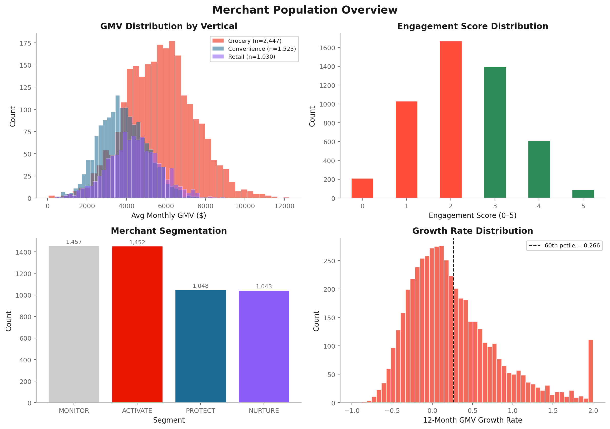
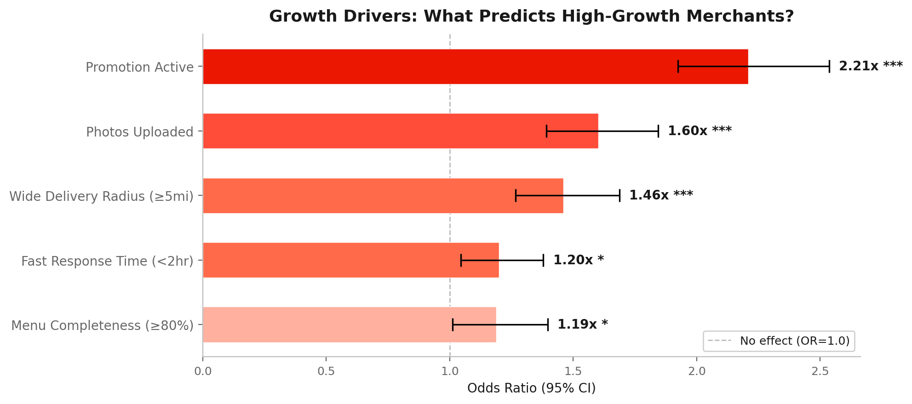
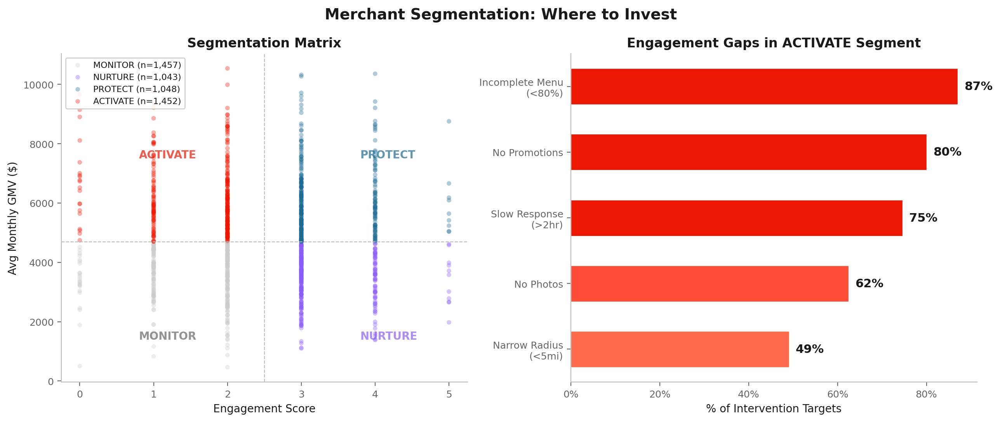
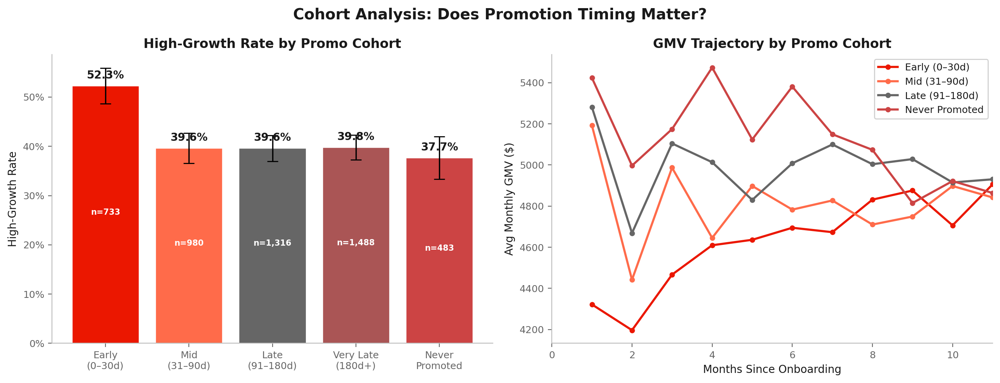
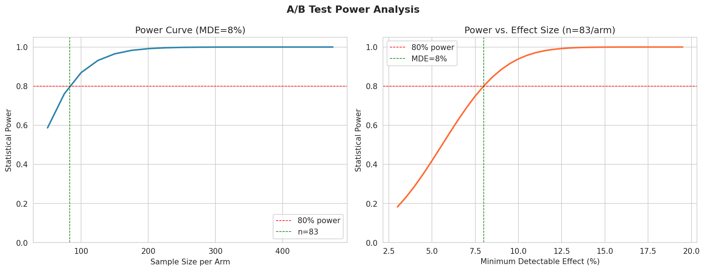
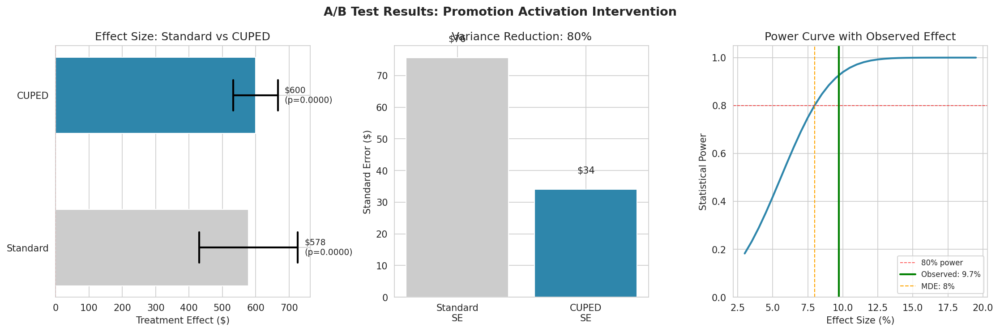

# Promotion Activation Is the #1 Growth Lever for New Vertical Merchants

**Merchants who activate promotions are 2.2x more likely to become high-growth**, and 80% of the intervention pool hasn't activated one yet. This project identifies the lever, sizes the opportunity, and designs the experiment.

Portfolio Project by **Ashwath Subramanyan** | Data Scientist (Analytics)

---

## Why This Matters Now

DoorDash new verticals (grocery, convenience, retail) grew 25% YoY in Q3 2025 vs. Instacart at 10%. But platform growth masks a merchant-level problem: most new-vertical merchants stall after onboarding. They sign up but never activate promotions, expand delivery radius, or complete their menu. The funnel stages where merchants drop off aren't obvious from top-line metrics.

This project maps the merchant growth funnel — **Onboard → Activate Promos → Expand Radius → Upload Content → Achieve High Growth** — and pinpoints where the biggest drop-off happens.



## The Insight

Across 5,000 new-vertical merchants, **promotion activation is the strongest predictor of growth**: OR=2.21, 95% CI [1.92, 2.54], p<0.001. Merchants who activate promos within 30 days hit a 52.3% high-growth rate vs. 39.6% for late adopters. Propensity score stratification puts the causal ATE at +18.5%.

Other significant drivers: wide delivery radius (OR=1.46), photo uploads (OR=1.60), menu completeness (OR=1.19), response time (OR=1.20). Three of five survive Bonferroni correction at α=0.01.



## The Opportunity

A 2×2 segmentation on GMV × engagement reveals four segments:

| Segment | Merchants | Annual GMV | Profile |
|---------|-----------|------------|---------|
| **ACTIVATE** | 1,452 | $108M | High GMV potential, low engagement |
| PROTECT | 1,048 | — | High GMV, high engagement |
| NURTURE | 1,043 | — | Low GMV, high engagement |
| MONITOR | 1,457 | — | Low GMV, low engagement |

The ACTIVATE segment has the order volume and basket size to grow but hasn't pulled the engagement levers. 80% lack active promotions. The non-high-growth subset (970 merchants, $71.7M annual GMV) is the intervention pool.



## What I'd Recommend

**1. Promo activation as a Day-1 onboarding milestone.** Early adopters hit 52.3% high-growth; late adopters 39.6%. Lowest-friction lever available.

**2. Default delivery radius from 3mi to 5mi.** 1.46x growth odds, no degradation in ratings or cancellations. Config change, not behavior change.

**3. A/B test before scaling.** n=83/arm, 90 days, stratified by vertical × region, CUPED-adjusted (79.7% variance reduction). Simulated result: SHIP — p<0.001, all guardrails pass, +$600/mo per merchant.

**4. AI-powered growth playbooks.** RAG system (ChromaDB + DSPy) generating personalized merchant action plans. Extends MSM coverage 10x without adding heads.

## How I Validated It

**Data pipeline (Medallion Architecture).** Bronze → Silver → Gold across 5,000 merchants, 60K engagement records, 60K orders. Five DQ gates. Built for Databricks Delta Lake with Auto Loader and DLT patterns.

**Driver analysis.** Logistic regression with vertical, region, and tenure controls. Chose logit over gradient boosting because the goal is telling MSMs which levers to pull, not predicting who will grow. Interpretable ORs serve that need; AUC of 0.633 is appropriate for a driver-ID model.

**Causal inference.** Propensity score stratification controlling for vertical, region, tenure, and GMV. Limitation: unobserved confounders (merchant motivation, product quality). Hence the RCT design below.

**Cohort analysis.** Five promotion-timing cohorts, chi-squared p<0.001. GMV trajectories show the gap between early and late adopters compounds over 12 months.



**Experiment design.** Power analysis, stratified randomization, CUPED variance reduction, guardrail metrics (churn, complaints, delivery time), SRM detection (p=0.75), and a ship/iterate decision framework.





## What I'd Do With Real Data

Synthetic data calibrated to DoorDash public benchmarks. With real data I'd extend three ways:

**Survival analysis.** Cox PH on real tenure data to model *when* merchants churn and quantify the retention value of each lever.

**Difference-in-differences.** DoorDash has rolled out onboarding and radius changes across markets at different times. DiD on those natural experiments gives causal estimates without a new RCT.

**Heterogeneous treatment effects.** Causal forest to estimate how promo impact varies by vertical — could be 3x in convenience, 1.5x in grocery. That changes how you prioritize the intervention mix.

## Project Structure

```
├── notebooks/
│   ├── 01_medallion_data_pipeline.py    # Bronze → Silver → Gold ETL
│   ├── 02_statistical_analysis.py       # Driver analysis, causal inference, cohorts
│   └── 03_experiment_design.py          # A/B test design with CUPED
├── data/                                # Parquet files (Bronze/Silver/Gold layers)
├── outputs/                             # Visualizations and analysis results
└── sql/                                 # SQL practice queries
```

## Tech Stack

Python · Databricks Medallion Architecture (Bronze/Silver/Gold) · statsmodels · scipy · scikit-learn · matplotlib

## Data Transparency

All data is synthetic, calibrated to DoorDash public benchmarks. Market context from Q3 2025 earnings (DoorDash +25% YoY GOV, Instacart +10% YoY). Effect sizes use a calibrated log-odds formulation. All claims carry 95% CIs, p-values, and explicit causal vs. correlational labeling.
